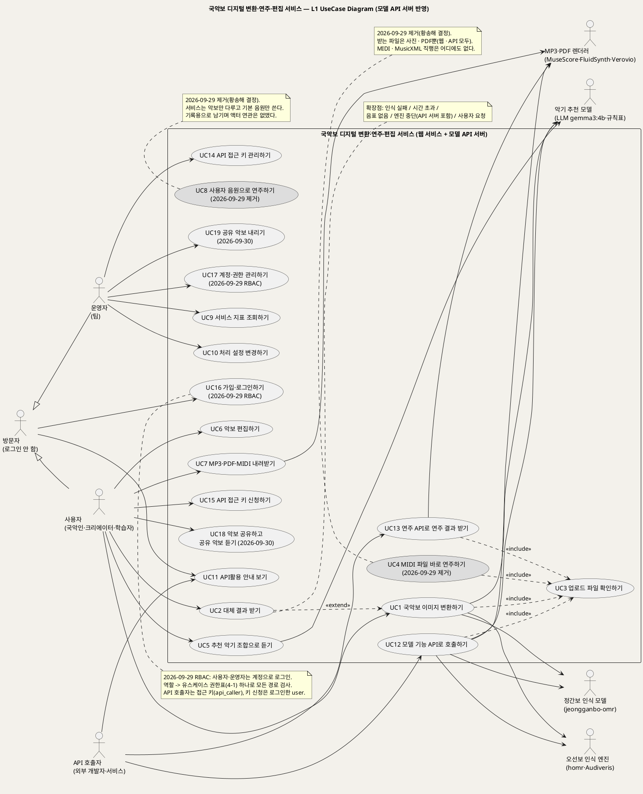

# UseCase 개요 — 국악보 디지털 변환·연주·편집 서비스 (1단계)
**국악보 변환 서비스 · UC 개요 · UML 2.5.1 표준 (L1 UseCase Diagram + 유스케이스 목록)**

---

> **문서 식별**: `design/UC_00_개요_국악보변환서비스.md`
> **작성일**: 2026-09-23 · **수정일**: 2026-09-28 (모델 API 서버·API활용 메뉴·연주 API 반영, UC11~UC14 추가 — 조성기) · **표준**: UML 2.5.1 (OMG)
> **수정일**: 2026-09-30 (악보 공유 · 좋아요 — 황송해 결정) — **UC18 악보 공유하고 공유 악보 듣기**(사용자) · **UC19 공유 악보 내리기**(운영자) 추가(`UC_18_악보공유하기.md`). §4-1 권한표에 `user` UC18 · `operator` UC19, UC 목록 · L1 도면 갱신.
> **수정일**: 2026-09-29 (RBAC 운영자 메뉴 — 조성기) — UC17 계정·권한 관리하기 추가(운영자, 관리자 화면 S7). §4-1 권한표에 operator 의 UC17, L1 도면·UC 목록·액터 갱신. 원천 spec FR-069.
> **수정일**: 2026-09-29 (구현 반영 — 황송해) — UC8 사용자 음원으로 연주하기 제거(문서는 기록용으로 남김), 오선보 엔진 순서 homr → Audiveris(oemer 제거), 악기 추천 규칙 완화(국악기·선율 악기 필수 없음), 서비스 재생용 국악기 번호(bank 1) 반영. 수정 전 원본은 `backup/원본_20260929_HSH_설계문서반영/` 에 있다.
> **수정일**: 2026-09-29 (올리기 화면 변경 — 황송해 결정) — ~~웹은 사진(PNG · JPG(JPEG) · WEBP)만 받는다. UC4 MIDI 파일 바로 연주하기를 웹에서 제거(문서는 기록용으로 남김), 경로 배정 · L1 도면 · 미해결 22 갱신. 연주 API의 MIDI · MusicXML 직행은 유지(현재 기본안, 사용자 확인 대기).~~ (아래 줄 "사진·PDF 입력" 결정으로 바뀜)
> **수정일**: 2026-09-29 (사진·PDF 입력 — 황송해 결정) — 받는 파일은 **사진(PNG · JPG(JPEG) · WEBP)과 PDF, 웹·API 모두**. MIDI · MusicXML은 어디서도 받지 않아 UC4(직행)를 **웹·API 모두에서 제거**했다(문서는 기록용). PDF는 서버가 첫 쪽을 300dpi 사진(PNG)으로 바꾼 뒤 사진과 같은 흐름으로 처리하고, 여러 쪽이면 첫 쪽만 변환해 "PDF 첫 쪽만 변환했어요(전체 N쪽)"를 알린다. 원래 악기(BR-PLY-04)는 입력이 없어 사용 안 함. 경로 배정 · UC 목록 · L1 도면 note · 미해결 22 갱신.
> **수정일**: 2026-09-29 (역할 기반 접근 제어 RBAC — 조성기) — 사용자도 계정으로 로그인(익명 세션 폐지), 역할 4개(user·operator·api_caller·service)와 **§4-1 역할 → 유스케이스 권한표** 신설, UC16 가입·로그인하기 추가, 액터 '방문자' 추가, 사용자·운영자·API 호출자 설명과 L1 도면 갱신. 원천: spec FR-066~FR-068.
> **수정일**: 2026-09-29 (SAD 구현 반영 — 황송해) — 도면 소스는 그대로 두고 뷰어 링크만 SAD 규약(zlib + base64url)으로 다시 인코딩(내용은 같았고 인코딩 방식만 달랐음). 렌더 HTTP 200 확인.
> **수정일**: 2026-09-29 (여러 쪽 · PDF 확인 불가 — 황송해 결정) — 'PDF 첫 쪽만' 대신 여러 장 모두 변환(한 요청 = 악보 한 곡(여러 쪽): PDF 한 개(모든 쪽을 300dpi로 변환) 또는 사진 여러 장(올린 순서), 한 요청 최대 10쪽(PDF 쪽수 또는 사진 장수)), 모델 API에 닿지 않으면 PDF 접수 거절. 경로 배정 · §6 경계(여러 쪽 묶음) · 업무규칙 개수 메모 갱신. §4-1 권한표(RBAC)는 역할과 UC 연결이 그대로라 영향 없음을 확인했다.
> **원천(SoT)**: `specs/001-gugak-score-conversion/spec.md` — 국악보 디지털 변환·연주·편집 서비스 (1단계) 기능 명세 (User Story 1~10, FR-001~FR-061, SC-001~SC-015, Assumptions — 2026-09-28 수정본). 보조 근거: `JSG/JSG_추천모델.md`, `JSG/JSG_서버자원확인.md`, `specs/001-gugak-score-playback/spec.md` US3
> **다이어그램**: PlantUML 소스는 모두 사내 렌더 서버 `plantuml.sumzip.com` 에서 렌더를 검증했다(HTTP 200 · image/svg+xml). 이 서버는 로그인 없이 열린다(2026-09-23 실측).

---

## 목차

1. [§1 시스템 목적·개요](#1-시스템-목적개요)
2. [§2 주요 기능](#2-주요-기능)
3. [§3 유스케이스 목록](#3-유스케이스-목록)
4. [§4 Actor 카탈로그](#4-actor-카탈로그)
5. [§5 L1 UseCase Diagram](#5-l1-usecase-diagram)
6. [§6 시스템 경계 (하지 않는 것)](#6-시스템-경계-하지-않는-것)
7. [§7 생성 결과](#7-생성-결과)
8. [§8 결론](#8-결론)

---

## 1. 시스템 목적·개요

국악 분야에는 정간보나 이미지로 된 악보 자료가 많지만, 디지털 오선보나 MIDI로 바꾸기 어려워 일반인과 음악 크리에이터가 쓰기 힘들다. 이 시스템은 사용자가 정간보·오선보 이미지나 국악 MIDI 파일을 올리면 수정할 수 있는 디지털 악보(MusicXML/MIDI)로 바꾸고, 웹에서 바로 보고 들을 수 있게 한다. 원하면 악기·음고·음량을 바꿔 다시 듣고, MP3·PDF·MIDI로 받아 갈 수 있다. (원천: `spec.md` 개요)

**서비스 방향 (2026-09-28 박예은 팀장 결정)**: 우리 악기와 음악을 알리는 서비스다. 결과 악보의 기본 연주는 국악기(기본 국악기 구성)로 하고, 사용자는 국악기 외 다른 악기(서양 악기 등)도 고를 수 있다. 악기 목록에서는 국악기를 앞에 둔다. (원천: `spec.md` 개요 · FR-020·021·023·056)

**미션(최상위 원칙)**: 접수된 악보 요청은 **하나도 결과 없이 끝나지 않는다**. 인식이 실패하거나 시간이 너무 오래 걸려도 사용자는 대체 템플릿을 포함한 들을 수 있는 결과를 받는다. (원천: `spec.md` 개요 · FR-015 · SC-001)

**이번 단계의 범위**: 장기 비전(전통 악보 디지털 아카이빙, 인터랙티브 국악 연주 생태계) 가운데 첫 단계다. 공개 악보 인식 엔진과 경량 악기 추천 모델을 붙이고, 실패 처리 계층과 편집·연주·렌더링 흐름을 끝까지 동작하게 만드는 데까지다. 목표 수치는 기준선을 측정한 뒤 정한다. (원천: `spec.md` 개요 · Success Criteria 머리말)

**모델 API 서버와 'API활용' (2026-09-28 추가)**: 모델을 쓰는 기능(오선보 인식·정간보 인식·악기 추천·MP3/PDF 렌더링)은 웹 화면과 분리된 **모델 API 서버**(Python 가상환경 + uvicorn)에 모은다. 웹 서비스는 모델을 직접 실행하지 않고 이 API 서버를 불러 쓰며, 외부 개발자도 같은 API 서버를 쓴다. 웹 서비스의 **'API활용' 메뉴**가 엔드포인트 목록·가이드라인·매뉴얼을 보여 준다. API 서버가 멈춰도 웹 서비스는 자체 대체 템플릿으로 결과를 돌려준다. (원천: `spec.md` 개요 · US10 · FR-038~FR-050)

## 2. 주요 기능

| 기능 | 설명 | 원천 근거 |
|---|---|---|
| 접수 전 확인 | 형식·손상·해상도·용량 검사를 하고, 통과하지 못한 파일은 이유와 함께 반려 | US3 · FR-001~FR-003 |
| 경로 배정 | 이미지는 사용자가 고른 종류(정간보/오선보)의 인식 변환, ~~MIDI·MusicXML은 직행(2026-09-29부터 연주 API로 온 것만 — 웹은 사진만 받음)~~, 변환 불가 이미지는 대체 경로로 배정. (2026-09-29 사진·PDF 결정) PDF는 ~~첫 쪽을~~ 모든 쪽을 300dpi 사진으로 바꿔 이미지와 같이 배정하고(2026-09-29 여러 쪽: 사진 여러 장 · PDF 모든 쪽, 최대 10쪽), MIDI·MusicXML은 받지 않아 직행은 없다 | FR-001 · FR-004 · FR-005 |
| 악보 변환 | 이미지를 MusicXML·MIDI로 변환. 엔진 버전은 고정하고 기록 | US1 · FR-006 · FR-009 · FR-010 |
| 대체 경로(결과 보장) | 인식 실패·시간 초과·음표 없음·사용자 요청·구조 확인 불통과·타당성 불신이면 기본 국악 장단 템플릿을 반환 | US2 · FR-011~FR-015 |
| 인식 전·후 확인 | 엔진에 보내기 전 고른 종류의 악보 구조(오선·정간 격자)를 확인해 가짜 악보는 반려 없이 대체 결과로 보내고, 인식 결과는 신뢰/주의/불신 등급을 매겨 불신이면 대체 | FR-057~FR-059 · SC-016 · SC-017 |
| 보기·연주·내려받기 | 오선보로 표시하고, 기본 국악기 구성으로 연주하고(추천 조합·원래 악기로 바꿔 듣기 가능), MusicXML/MIDI로 내려받기 | FR-019~FR-022 · FR-056 |
| 악기 추천 | 분위기·빠르기를 바탕으로 악기 조합을 추천(국악기·선율 악기를 꼭 넣지 않아도 됨 — 2026-09-29 변경). 추천이 실패해도 연주는 막히지 않음 | US5 · FR-007 · FR-008 |
| 편집 | 악기 추가/변경(국악기가 앞에 있는 목록, 다른 악기도 선택 가능), 조옮김, 트랙·음표 음량, 음표 음고 수정, 자동 저장, 원본 되돌리기 | US6 · FR-023~FR-029 |
| ~~사용자 음원(.sf2)~~ | **제거 (2026-09-29, 황송해 결정 — 서비스는 악보만 다루고 기본 음원만 씀)**. 예전 내용: 50MB 이하 .sf2를 올려 트랙 악기로 쓰기, 세션이 끝나면 삭제 | US8 · FR-030 · FR-031 |
| MP3·PDF·MIDI 내려받기 | 편집 내용을 반영한 MP3·MIDI·MusicXML과 인쇄용 PDF 제공. MIDI·MusicXML은 렌더러 없이 바로 받음(UC 이름은 그대로 두고 MusicXML 받기를 2026-09-28 추가). MP3·PDF가 실패해도 다른 기능은 계속 쓸 수 있음 | US7 · FR-032 · FR-033 |
| 관찰·설정 | 요청별 기록, 5개 지표 조회, 엔진 순서·시간 제한·대체 사용 여부 변경 | US9 · FR-016~FR-018 · FR-034~FR-036 |
| 임시 보관 | 업로드 원본과 결과물을 보관 기간 뒤 자동 삭제하고, 만료된 요청을 열면 안내 | FR-037 |
| 모델 API 서버 | 오선보 인식·정간보 인식·악기 추천·MP3/PDF 렌더링·연주 요청·상태 조회 엔드포인트를 uvicorn 가상환경 서버로 제공. 웹과 외부 호출자가 같은 규칙으로 사용 | US10 · FR-009 · FR-038~FR-042 |
| 'API활용' 메뉴 | 엔드포인트 목록·가이드라인·매뉴얼을 웹 서비스 메뉴로 제공. 실행 중인 API 서버 명세와 일치 | US10 · FR-043 · FR-044 |
| 연주 API | 악보 파일을 보내면 요청 번호를 받고, 상태를 조회해 MP3·MusicXML·MIDI를 받음 | US10 · FR-047~FR-050 |
| 접근 키·호출 한도 | 호출자가 'API활용' 메뉴에서 신청하면 운영자 승인 없이 바로 발급(기본 호출 한도, 신청 빈도 제한, 개인정보 안내·동의). 키는 제출 직후 한 번만 표시하고 해시로만 저장. 신청 내용은 7일 임시 보관 후 삭제, 운영자가 조회·보관 처리 가능. 운영자는 폐기·한도 조정. 오류 응답은 한 형식 | FR-045 · FR-046 · FR-048 · FR-053~FR-055 · FR-060 · FR-061 |
| 관리자 화면 | 운영 기능은 `operator` 역할 계정으로 로그인하는 내부망 전용 관리자 화면에서 쓰고, 설정 변경·키 발급·폐기 이력을 남김 | FR-051 · FR-052 |
| 계정·역할 (2026-09-29) | 사용자·운영자는 한 계정 표로 가입·로그인하고, 역할 → 유스케이스 권한표 하나로 모든 경로를 검사(RBAC). API 호출자는 접근 키로 `api_caller` 역할 | FR-066~FR-068 |

## 3. 유스케이스 목록

| UC ID | 유스케이스명 | 주액터 | 우선순위 | 원천 근거 | 문서 | 상태 |
|:--:|---|---|:--:|---|---|:--:|
| UC1 | 국악보 이미지 변환하기 | 사용자 | 19,049자 | US1 · FR-004·006·009·010·015·016·017·019·020·022 · FR-057~059 | E1~E11 (11) | 완료 (API 서버 반영 2026-09-28) · 인식 전후 확인 반영 2026-09-28 | · 인식 전후 확인 
| UC2 | 대체 결과 받기 | 사용자 | 13,892자 | US2 · FR-011~FR-015 · Edge Cases · FR-057~059 | E1~E5 (5) | 완료 (API 서버 반영 2026-09-28) · 인식 전후 확인 반영 2026-09-28 | · 인식 전후 확인 
| UC3 | 업로드 파일 확인하기 | 사용자 | 12,042자 | US3 · FR-001~FR-003 · Assumptions(값의 기본 설정) | E1~E7 (7) | 완료 (API 서버 반영 2026-09-28) |
| ~~UC4~~ | ~~MIDI 파일 바로 연주하기~~ | 사용자 | 10,475자 | US4 · FR-004·005·019~022 | E1~E3 (3) | **제거 (2026-09-29, 황송해 결정 — 받는 파일은 사진·PDF뿐, 웹·API 모두 직행 없음)** ~~웹에서 제거 · 직행은 연주 API(UC13)에서만~~. 문서는 기록용으로 남김 |
| UC5 | 추천 악기 조합으로 듣기 | 사용자 | 11,694자 | US5 · FR-007·008·021 | E1~E5 (5) | 완료 (API 서버 반영 2026-09-28) |
| UC6 | 악보 편집하기 | 사용자 | 11,378자 | US6 · FR-023~FR-029 | E1~E4 (4) | 완료 |
| UC7 | MP3·PDF·MIDI 내려받기 | 사용자 | 18,841자 | US7 · FR-032·033 | E1~E9 (9) | 완료 (MIDI 추가 2026-09-23, API 서버·MusicXML 받기 반영 2026-09-28) |
| ~~UC8~~ | ~~사용자 음원으로 연주하기~~ | 사용자 | 9,715자 | US8 · FR-030·031 · Edge Cases | E1~E5 (5) | **제거 (2026-09-29, 황송해 결정 — 서비스는 악보만 다루고 기본 음원만 씀)**. 문서는 기록용으로 남김 |
| UC9 | 서비스 지표 조회하기 | 운영자 | 13,045자 | US9 · FR-034~FR-036 · SC-007~SC-011 · FR-057~059 | E1~E6 (6) | 완료 (API 서버 반영 2026-09-28) · 인식 전후 확인 반영 2026-09-28 | · 인식 전후 확인 
| UC10 | 처리 설정 변경하기 | 운영자 | 14,475자 | US9 AC3 · FR-018 · FR-057~059 | E1~E8 (8) | 완료 (API 서버 반영 2026-09-28) · 인식 전후 확인 반영 2026-09-28 | · 인식 전후 확인 
| UC11 | API활용 안내 보기 | API 호출자 | 12,955자 | US10 AC1 · FR-043·044 | E1~E3 (3) | 완료 |
| UC12 | 모델 기능 API로 호출하기 | API 호출자 | 19,116자 | US10 AC2·AC4 · FR-038~041·045·046·048·049 · FR-057~059 | E1~E10 (10) | 완료 · 인식 전후 확인 반영 2026-09-28 | · 인식 전후 확인 
| UC13 | 연주 API로 연주 결과 받기 | API 호출자 | 17,735자 | US10 AC3 · FR-047·049·050 · playback US3 · FR-057~059 | E1~E7 (7) | 완료 · 인식 전후 확인 반영 2026-09-28 | · 인식 전후 확인 
| UC14 | API 접근 키 관리하기 | 운영자 | 15,245자 | FR-045·046 · FR-018 · FR-051~055 · FR-060·061 | E1~E6 (6) | 완료 |
| UC15 | API 접근 키 신청하기 | API 호출자 (2026-09-29 RBAC: 로그인한 `user` 만 신청) | 12,473자 | US10 · FR-053·054·055 · FR-060·061 | E1~E4 (4) | 완료 |

| UC16 | 가입·로그인하기 | 방문자 · 사용자 · 운영자 | High | FR-066·067·068 · FR-031 · FR-051 | E1~E6 (6) | 신설 (2026-09-29 RBAC — 조성기) |
| UC17 | 계정·권한 관리하기 | 운영자 | Medium | FR-069 · FR-051·052 · FR-066~068 | E1~E5 (5) | 신설 (2026-09-29 RBAC 운영자 메뉴 — 조성기) |
| UC18 | 악보 공유하고 공유 악보 듣기 | 사용자 | Medium | 2026-09-30 황송해 결정(FR 대기) | E1~E5 (5) | 신설 (2026-09-30 — 황송해, `UC_18_악보공유하기.md`) |
| UC19 | 공유 악보 내리기 | 운영자 | Medium | 2026-09-30 황송해 결정(FR 대기) | E1~E2 (2) | 신설 (2026-09-30 — 황송해, `UC_18_악보공유하기.md` §5.2) |

- 우선순위는 원천 User Story의 Priority를 따른다: P1은 High, P2는 Medium, P3는 Low.
- [추론] UC9와 UC10은 원천의 User Story 9 하나에서 나왔다. "지표를 본다"와 "설정을 바꾼다"는 운영자의 목표가 다르기 때문에 둘로 나눴다.
- [추론] UC11~UC15는 원천의 User Story 10 하나에서 나왔다. "안내를 본다", "모델 기능을 부른다", "연주 결과를 받는다", "접근 키를 관리한다(운영자)", "접근 키를 신청한다(호출자)"는 액터나 목표가 달라서 다섯으로 나눴다. UC15는 2026-09-28 키 신청 방식 결정(FR-053~055)으로 추가했다. 연주 API(UC13)는 원래 `001-gugak-score-playback` 명세에만 있었으나 2026-09-28에 원천 명세로 합쳤다.
- [추론] UC3(업로드 파일 확인하기)은 UC1·UC4와 API로 들어오는 UC12·UC13이 **항상** 거치는 행위라서 «include»로 분리했다. UC2(대체 결과 받기)는 특정 조건에서만 일어나므로 UC1의 «extend»로 두었다.

## 4. Actor 카탈로그

| 구분 | Actor | 설명 | 관련 UC | 원천 근거 |
|---|---|---|---|---|
| Primary | 방문자 (2026-09-29) | 로그인하지 않은 사람. UC11 API활용 안내 보기와 UC16 가입·로그인만 쓸 수 있다 | UC11 · UC16 | FR-068 |
| Primary | 사용자 | 국악인·크리에이터·학습자. (2026-09-29 RBAC) 스스로 가입한 계정(`user` 역할)으로 로그인해 컴퓨터 웹 브라우저에서 이용. 요청은 계정 소유 | UC1~UC7 (UC8은 2026-09-29 제거, UC4는 2026-09-29 제거) | 가치제안 · Assumptions(사용자와 접근) |
| Primary | 운영자 | 서비스를 운영하고 측정하는 팀. 팀원별 계정(`operator` 역할, 2026-09-29 RBAC)으로 내부망 전용 관리자 화면에 로그인 | UC9 · UC10 · UC14 · UC17 | US9 · FR-051 |
| Primary | API 호출자 | 모델 API 서버를 프로그램에서 부르는 외부 개발자·서비스. 'API활용' 메뉴에서 신청하면 바로 발급되는 접근 키로 사용(키 = `api_caller` 역할). 키 신청은 사용자 계정으로 로그인해서 한다(2026-09-29 RBAC) | UC11~UC13 · UC15 | US10 · FR-045 · playback Assumptions |
| Secondary | 오선보 인식 엔진 | 오선보 이미지를 MusicXML로 바꾸는 공개 OMR 엔진. 기본 순서 homr → Audiveris(oemer는 장당 2~8분이라 처리 시간 제한을 넘고 박자표가 없어 2026-09-29 제거). 모델 API 서버 뒤에서 버전을 고정해 운영 | UC1 · UC2 · UC12 | FR-006 · FR-009 · FR-018 · Assumptions(의존성) |
| Secondary | 정간보 인식 모델 | 정간보 이미지를 인식하는 MALerLab jeongganbo-omr. 자체 인코딩 결과를 API 서버가 MusicXML로 바꿈 | UC1 · UC2 · UC12 | FR-006 · FR-041 · Assumptions(의존성) |
| Secondary | 악기 추천 모델 | 분위기·빠르기로 악기 조합을 추천(2026-09-29부터 국악기 필수 아님). Ollama LLM(gemma3:4b)이 먼저, 준비 중·규칙 위반·실패면 규칙표(rules.yaml) — 2026-09-29 구현 반영(scikit-learn 계획은 LLM으로 대체) | UC1 · UC5 · UC12 | FR-007 · FR-009 · Assumptions(의존성) |
| Secondary | MP3·PDF 렌더러 | MuseScore Studio CLI(기본), FluidSynth(MP3 — 기본 음원 묶음 gugak.sf2·FluidR3_GM.sf2별로 성부를 나눠 렌더링한 뒤 섞음, 2026-09-29 변경. 사용자 .sf2 트랙은 제거), Verovio(PDF 대안) | UC7 · UC12 · UC13 | FR-032 · FR-038 · Assumptions(의존성) |

- 구체적인 제품 이름은 2026-09-28 원천 명세 Assumptions(의존성)에 우선 후보로 들어갔다(`JSG/JSG_추천모델.md` 근거). 최종 확정은 첫 주 측정 뒤다.
- 모델 API 서버는 액터가 아니라 **시스템 경계 안의 구성요소**다. 웹 서비스와 모델 사이에 있으며 각 UC의 시퀀스 다이어그램에 lifeline으로 나온다.

### 4-1. 역할 → 유스케이스 권한표 (RBAC, 2026-09-29 — FR-068)

이 표가 **유일한 권한 기준**이다. DB `role_permission`(SD_03)에 그대로 들어가고, 웹 서비스·관리자 화면·모델 API 가 요청마다 이 표로 검사한다(UC16 BR-AUTH-03·04). 표에 없는 조합은 모두 거절한다.

| 유스케이스 | 방문자(로그인 안 함) | `user` | `operator` | `api_caller`(접근 키) | `service`(웹→모델 API) |
|---|:-:|:-:|:-:|:-:|:-:|
| UC1 국악보 이미지 변환하기 | | O | | | O (웹 요청을 대신 처리) |
| UC2 대체 결과 받기 | | O | | | O |
| UC3 업로드 파일 확인하기 | | O | | | O |
| ~~UC4~~ (2026-09-29 제거 — 웹·API 모두) | | | | | |
| UC5 추천 악기 조합으로 듣기 | | O | | | O |
| UC6 악보 편집하기 | | O | | | |
| UC7 MP3·PDF·MIDI 내려받기 | | O | | | O |
| UC9 서비스 지표 조회하기 | | | O | | |
| UC10 처리 설정 변경하기 | | | O | | O (설정 반영 알림) |
| UC11 API활용 안내 보기 | O | O | O | O | |
| UC12 모델 기능 API로 호출하기 | | | | O | O |
| UC13 연주 API로 연주 결과 받기 | | | | O | |
| UC14 API 접근 키 관리하기 | | | O | | O (모델 등록부 다시 읽기 등) |
| UC15 API 접근 키 신청하기 | | O | | | |
| UC16 가입·로그인하기 | O | O | O | | |
| UC17 계정·권한 관리하기 (2026-09-29) | | | O | | |
| UC18 악보 공유하고 공유 악보 듣기 (2026-09-30) | | O | | | |
| UC19 공유 악보 내리기 (2026-09-30) | | | O | | |

- 한 계정이 역할을 여러 개 가질 수 있다(예: 팀원 = `operator` + `user`). 가입하면 `user` 만 받고, `operator` 는 관리자 명령으로만 준다.
- 판정 순서: ① 누구인지(세션 → 계정 / 접근 키 → 키) ② 역할 모음 ③ 경로 → 유스케이스 ④ 이 표 ⑤ 요청 번호가 있으면 소유 확인. 로그인 안 함 401, 역할 없음 403(UC16 E5·E6).
- 관리자 화면이 내부망에서만 열리는 제한(FR-051)은 이 표와 별개로 그대로 둔다.

## 5. L1 UseCase Diagram

**[「L1 전체 유스케이스」 PlantUML 뷰어로 열기](https://plantuml.sumzip.com/plantuml/svg/eNqdV19vGkcQf79PMXJesFocDvAfrChKYsdRKruNEqXqQyTrDBd8Db6z4HBatZWIhaPUJg2WIQbncLFMErsiKgViiOSoEh-lj7d736Gz9wfurkkUlaed2_nNzsz-dma4klGFtJpdS0E2vpzMJoUHy6HQsrIhpjck8SGXeSDJ60JaWIMVIf4gmVaycmJOSSlpuLAQWeCvX3NpZFaFhPJQkpNwX0hlRC4l3ldBVSAtJVdVSEhpMa5KisypkpoSQX_7hpa3SKcLpFSir3NGvg-kkzOqlUGP7rfo8fmgZ_zWp693geY18i5PtxvwT64EizzczYhzQkaEeUlIspMD5I8T8rQPV2_dNJXbeSCtCq08Guc4Ia6it2OkdUqafXpYvCcHyJGm9_q01gdafgJG-WR8DIQM3MiKGdXRp5tNenBq6Vuuoj569KhJXjXpfpHWuka-hR_KVbr9FvUsG-hZemjioIsuWCaMQs5S-GY94-wzb41Kn55plg6t9slZDvSWRlrsE-bBCdzCzosbQ9uVBs3XWfbQLbpTA7qPScyjlVVlLT3oXc0mJLxDKWOfunR7iKyX9VbehbRyh8jvRUVOJgV5RQmiDQv41Y1rQ2B5S--3gJ6VaFsboRYXlyAprq0JkdnoyqCn9zT6rmrsahb-9vU5B790KzLo3ZpfAFIvkKcl8nsT0UvZjHgnrqTFQW8hlZUSd36U1dVB71sxrWxIim3j63mOY-QR5CQSZ-x_MSdAX7xziV_AfyiDh_3EAaBDccatsbtzvIukeN_kT7SZs48yyhXMhnXnc7wXFwZSyNF2F_R2S--cIxdfjHTDXt0I3twWEpLsaWAUCrR2Dka1jFfjOSDiBUVh6eb8TUeftEpoAKzQLRhmNhwKTwVDsWA4BrSu6X-1bIIi-MK8-fPanHRu1rnno5ZRPqXaObNN9o5Hzkx6gVNgp8jKucfvKa_qNDgkGPTMCMhml9QbnvxMeyEzMHyJeAcF-qJou_S54c58ONyYiwyMQ7uaGfFBweN_zEeIENB2BQsAghv4kBgX9PZ7LxdCPgzPOGZUNQyC1RsMGWFdF8DHHj7scBN1yPZLBmcBW6XCe5aPTHzETouDsaUP8ZD3cYqPWm-hvqv3kIObDdC7OQzVe2DUB5r0g-hOnbbfeEE-wvBTWONy9HBr0BtW4g_d4-1rV-ecW-R9TOKnQe_k8Qqw4pzhnWkebz9hx0cvfsZhr955S7U6w3fq92RLcvYs-sPQaCQ0tDfjsxcDHxQZ_qrp9ckFj3G_cBxrGhAMXjYriUsIu4VJtzDlFqY5bCr2OuZaIxNdQtQtuCHog9uBGQ7bjCPwbiHsFiIe0CRnNs8RzCNO2eKln4NBq0O6ZNYQOVZrJyaYcgRm4dIlSY6nsgnx8mWO1auP7eBL-ehW5KNbDog3d8QfVFFO4IbpA3OY9Upnzdqfs2atjJXJ0XraWmN7Mn1xgcNudNgFcQQLExkKnKyoIg5L66Dcd-juo_DsqBJin3NmC7Jdsl-CU6qdJzWBJug-PsU64CFISSx19DyHjYzVPOvVYNkLRIP8OA5BFbJZMfFYe_bqWDLeM0lv5_BUZsozrbBTR48-IKxLy3EhlRLT41-6qgCt5cD1wjX2UNITHOYbWLh20NZ4aIbNyhnrfocvab04OxxtdhpG4QQu4kLD0QVo9wmrZhdZfLWCWbn3H-OKaZhTENDGLtk5CbjGQeNZk815TGXUTg6w373xu7OiqKqyZvkT9d6C1VgCRvWUPj4yymZ_x8SPs_RgbWVJsVoyC5ydg64MeoDtjvxdNAcQlJhTLMe7RRNntkH8jIOQFP9uaRGb0SPj-a-mheddNuDsF8mzPAuR7DQmPuXtzOd7O-x95kWalYq8LgCeQI5PsACarafTtzsu26J7XfN8MLeOaiyHNuE2T9inUxwZykc4E7Omg8XYjADvpdz1-n0FV_h341-T_4iy)** — 클릭 시 브라우저로 연결됩니다.

#### 다이어그램 쉽게 읽기 (유저 관점)

- **누가 쓰나**: 왼쪽의 **사용자**는 악보를 올리고, 듣고, 고치고, 받아 가는 사람이다. **운영자**는 서비스가 잘 도는지 숫자로 보고 설정과 접근 키를 관리하는 팀이다. **API 호출자**는 화면 대신 프로그램으로 같은 기능을 쓰는 외부 개발자다. 오른쪽의 **오선보 인식 엔진·정간보 인식 모델·악기 추천 모델·MP3·PDF 렌더러**는 사람이 아니라 시스템이 모델 API 서버를 통해 도움을 받는 바깥 도구다.
- **무슨 순서로**: 사용자는 악보 사진(UC1)을 올린다. MIDI 파일 올리기(UC4)는 2026-09-29에 웹에서 없앴다(회색으로 남김 — MIDI · MusicXML은 연주 API로만). 결과 악보가 나오면 추천 악기로 듣거나(UC5), 고치거나(UC6), 파일로 받아 간다(UC7). 자기 음원으로 연주하기(UC8)는 2026-09-29에 없앴다(회색으로 남김).
- **API로 쓰는 순서**: 외부 개발자는 'API활용' 메뉴에서 안내를 보고(UC11), 접근 키를 신청해 그 자리에서 받은 뒤(UC15, 운영자는 UC14에서 사후 확인), 받은 키로 모델 기능을 부르거나(UC12) 연주 결과를 받는다(UC13).
- **«include» = 항상 함께**: 화면으로 올리든 API로 보내든 **반드시** 파일 확인(UC3)을 먼저 거친다.
- **«extend» = 특정 상황에서만**: 인식이 실패하거나 너무 오래 걸리면, 또는 사용자가 원하면 **그때만** 대체 결과 받기(UC2)가 끼어든다.
- **Generalization(◁)**: 이 다이어그램에는 없다. 유형만 다르고 같은 목표인 유스케이스가 원천에 없기 때문이다.

| 기호 | 의미 |
|---|---|
| 사람 모양(actor) | 시스템을 쓰는 사람이나 바깥 시스템 |
| 타원(usecase) | 액터가 이루려는 목표 하나 |
| 사각형(rectangle) | 시스템 경계. 안쪽이 이 시스템의 책임 |
| 실선 | 액터와 유스케이스의 연관 |
| 점선 화살표 «include» | 기본 UC가 항상 포함하는 하위 행위 |
| 점선 화살표 «extend» | 조건이 맞을 때만 기본 UC에 끼어드는 행위 |

## 6. 시스템 경계 (하지 않는 것)

원천 `spec.md` Assumptions(범위 경계 · 사용자와 접근)에서 그대로 옮겼다.

- 로그인·회원 관리는 하지 않는다. 익명 세션으로만 쓴다.
- 휴대폰 화면 최적화는 하지 않는다. 컴퓨터 웹 브라우저가 대상이다.
- ~~여러 쪽짜리 악보 묶음 처리는 하지 않는다. 요청 하나에 이미지 한 장이다.~~ (2026-09-29 황송해 결정) 요청 하나 = 악보 한 곡이고 여러 쪽을 받는다: PDF 한 개(모든 쪽) 또는 사진 여러 장, 최대 10쪽. 11쪽 이상 묶음은 하지 않는다.
- 마우스로 오선보 마디를 끌어 고치는 편집 화면은 필수 범위가 아니다("가능하면" 하는 시연 항목).
- 국악원·아카이빙 사업단·교육기관 연계는 범위 밖의 확장 가설이다.
- 결제·수익 기능은 없다.
- 사용자 음원(.sf2)을 올려 연주하는 기능은 없다(2026-09-29, 황송해 결정 — 서비스는 악보만 다루고 기본 음원만 씀). UC8은 기록용으로만 남는다.
- 라이선스를 확인하기 전까지 MP3 렌더링 결과는 팀 내부 시연에만 쓴다. 국악기 외 다른 악기 음원(무료 공개 음원)도 같다(Assumptions 의존성과 미확인 사항).
- 요금제는 없다. 접근 키는 신청하면 운영자 승인 없이 바로 발급한다(FR-053, 2026-09-28 변경). 키를 이메일로 보내는 기능은 만들지 않는다(제출 직후 한 번만 표시, FR-054). 신청 이메일의 실제 주인 확인은 하지 않는다.
- 신청 내용(개인정보)은 7일만 임시 보관하고 지운다. 운영자가 보관 처리한 것만 따로 남는다(FR-060).
- 일반 사용자 로그인은 여전히 없다. 로그인은 운영자 관리자 화면에만 있다(FR-051).
- 서버에서 Docker를 쓸 수 없어 모델 API 서버는 컨테이너가 아니라 Python 가상환경 + uvicorn으로 운영한다(원천 Assumptions 의존성).
- 음원·렌더러 라이선스를 확인하기 전에는 API로 만든 MP3를 외부 호출자에게 내보내지 않는다(FR-050).

## 7. 생성 결과

2026-09-28 실측(모델 API 서버 반영 후, MusicXML 입력·운영자 접근·접근 키 신청·편집 반영 MusicXML 받기·기본 악기 국악기 결정, 인식 전 구조 확인·인식 후 타당성 확인(박예은 팀장 결정)까지 반영). 분량은 문서 전체 글자 수(공백 포함)다. 다이어그램은 UseCase Diagram + Sequence Diagram이며, 이번에 고치거나 새로 만든 다이어그램은 모두 `plantuml.sumzip.com` 에서 HTTP 200 · image/svg+xml · Syntax Error 없음을 확인했다. 형식은 `validate_usecase.py` 로 점검해 오류 0건이다. 수정 전 원본은 `backup/원본_20260928_API서버추가전/` 에 있다. 인식 전후 확인 반영 전 원본은 `원본_20260928_인식전후확인전/` 에 있다. 2026-09-29 구현 반영(황송해)으로 고친 다이어그램(개요 L1, UC1·UC5·UC6·UC7·UC12(2)·UC13)은 `plantuml.sumzip.com` 에서 다시 HTTP 200 · Syntax Error 없음을 확인했고, 아래 분량 수치는 2026-09-28 값 그대로다.

| UC ID | 유스케이스명 | 문서 | 분량 | 14속성 | 예외흐름 | 다이어그램 | 이번 변경 |
|:--:|---|---|:--:|:--:|:--:|:--:|---|
| UC1 | 국악보 이미지 변환하기 | `UC_01_국악보이미지변환하기.md` | 19,049자 | 14/14 | E1~E11 (11) | 2 | 수정 |
| UC2 | 대체 결과 받기 | `UC_02_대체결과받기.md` | 13,892자 | 14/14 | E1~E5 (5) | 2 | 수정 |
| UC3 | 업로드 파일 확인하기 | `UC_03_업로드파일확인하기.md` | 12,042자 | 14/14 | E1~E7 (7) | 2 | 수정 |
| UC4 | MIDI 파일 바로 연주하기 | `UC_04_MIDI파일바로연주하기.md` | 10,475자 | 14/14 | E1~E3 (3) | 2 | 수정 |
| UC5 | 추천 악기 조합으로 듣기 | `UC_05_추천악기조합으로듣기.md` | 11,694자 | 14/14 | E1~E5 (5) | 2 | 수정 |
| UC6 | 악보 편집하기 | `UC_06_악보편집하기.md` | 11,378자 | 14/14 | E1~E4 (4) | 2 | 수정 |
| UC7 | MP3·PDF·MIDI 내려받기 | `UC_07_MP3PDFMIDI내려받기.md` | 18,841자 | 14/14 | E1~E9 (9) | 2 | 수정 |
| UC8 | 사용자 음원으로 연주하기 | `UC_08_사용자음원으로연주하기.md` | 9,715자 | 14/14 | E1~E5 (5) | 2 | 수정 · 2026-09-29 제거 표시 |
| UC9 | 서비스 지표 조회하기 | `UC_09_서비스지표조회하기.md` | 13,045자 | 14/14 | E1~E6 (6) | 2 | 수정 |
| UC10 | 처리 설정 변경하기 | `UC_10_처리설정변경하기.md` | 14,475자 | 14/14 | E1~E8 (8) | 2 | 수정 |
| UC11 | API활용 안내 보기 | `UC_11_API활용안내보기.md` | 12,955자 | 14/14 | E1~E3 (3) | 2 | 신규 |
| UC12 | 모델 기능 API로 호출하기 | `UC_12_모델기능API로호출하기.md` | 19,116자 | 14/14 | E1~E10 (10) | 2 | 신규 |
| UC13 | 연주 API로 연주 결과 받기 | `UC_13_연주API로연주결과받기.md` | 17,735자 | 14/14 | E1~E7 (7) | 2 | 신규 |
| UC14 | API 접근 키 관리하기 | `UC_14_API접근키관리하기.md` | 15,245자 | 14/14 | E1~E6 (6) | 2 | 신규 |
| UC15 | API 접근 키 신청하기 | `UC_15_API접근키신청하기.md` | 12,473자 | 14/14 | E1~E4 (4) | 2 | 신규 |
| 합계 | 15건 | | 212,130자 | 210/210 | 93 | 30 (+ 개요 L1 1) | 수정 10 · 신규 5 |

## 8. 결론

### 8.1 도출 결과

- 유스케이스 **15개**(High 3 · Medium 9 · Low 3). 2026-09-28에 UC11~UC15 5개를 더했다. 2026-09-29에 UC8을 제거해 실제로 쓰는 UC는 **14개**다(UC8 문서는 기록용으로 남김).
- 액터 **7개**: Primary 3(사용자 · 운영자 · API 호출자), Secondary 4(오선보 인식 엔진 · 정간보 인식 모델 · 악기 추천 모델 · MP3·PDF 렌더러). 모델 API 서버는 액터가 아니라 시스템 경계 안의 구성요소다.
- (2026-09-29 여러 쪽 결정으로 BR-UPL-06 · BR-ENG-08 · BR-FBK-08 추가 — 아래 개수에는 아직 넣지 않았다) 업무규칙 **71개**, 도메인 13개: OPS 9 · API 8 · KEY 7 · RND 7 · FBK 7 · ENG 7 · EDT 7 · UPL 5 · SF2 4(2026-09-29부터 사용 안 함) · PLY 4 · RTE 3 · REC 2 · RET 1 (2026-09-29 BR-REC-02 추천 답 규칙 추가. 2026-09-28 인식 전후 확인으로 BR-ENG-06·07, BR-FBK-07, BR-OPS-09 추가. 같은 날 접근 키 자동 발급으로 BR-KEY-06·07 추가. 2026-09-29 UC8 제거로 BR-SF2-01~04는 사용 안 함)
- 관계: «include» 4개(UC1·UC4·UC12·UC13 → UC3), «extend» 1개(UC2 → UC1)
- 다이어그램 **31개**: 개요 L1 1개와 UC별 UseCase·Sequence 각 15개

### 8.2 원천 커버리지

| 원천 항목 | 원천 수 | UC로 전환 | 전환율 | 미전환 |
|---|:--:|:--:|:--:|---|
| User Story | 10 | 10 | 100% | 없음. US9는 UC9·UC10으로, US10은 UC11~UC15로 나눴다 |
| Functional Requirements | 59 | 59 | 100% | 없음. FR-057~FR-059(인식 전후 확인)는 UC1·UC2·UC9·UC10·UC12·UC13에 반영. FR-038~FR-050은 UC1·UC2·UC5·UC7·UC10~UC14에, FR-051~FR-055는 UC9·UC10·UC11·UC14·UC15에, FR-056은 UC4·UC5·UC6·UC7·UC13에 반영 |
| Success Criteria | 17 | 16 | 94% | SC-013 사용자 만족도. 시연 참여자 설문이라 시스템 기능이 아니어서 UC로 만들지 않았다 |
| Edge Cases | 18 | 18 | 100% | 없음. 인식 전후 확인 3건(가짜 악보 이미지, 빈 오선지, 종류 불일치)은 UC1 E10·E11·A7, UC2 A5·A6, UC12 E9·A6에 흡수. 새 3건은 UC1 E8·E9, UC2 A4, UC7 E4, UC8 A3으로 흡수 |

- 연주 API는 2026-09-23에는 원천 밖이었으나, 2026-09-28에 원천 명세 US10·FR-047로 합쳐 UC13으로 만들었다. `specs/001-gugak-score-playback/spec.md` 는 고치지 않았으므로 두 명세에 연주 API가 함께 있다(미해결 19번).

### 8.3 미해결 사항 (자료 없음 — 확인 필요)

| # | 항목 | 관련 UC |
|:--:|---|---|
| 1 | 대체 템플릿마저 불러오지 못할 때 사용자 화면에 보여 줄 내용 | UC1 E7 · UC2 E1 |
| 2 | 대체 경로 사용을 끌 수 있다는 FR-018과 결과 없는 요청 0건이라는 FR-015의 충돌 처리 | UC2 E3 · UC10 E1 |
| 3 | MIDI 파일의 용량 상한 값 | UC3 E4 |
| 4 | 악성 파일 검사 방법 | UC3 E6 |
| 5 | 음표가 하나도 없는 MIDI 파일의 처리 | UC4 E2 |
| 6 | 추천 조합의 개수, 대체 결과에도 추천을 제공하는지 여부, 응답 제한 시간 값(규칙표라 짧을 것으로 추정), 규칙표의 실제 내용 | UC5 |
| 7 | 사용자 기기에 자동 저장을 못 할 때의 처리 | UC6 E3 |
| 8 | 보관 기간(24시간)이 지난 뒤 기기에 남은 자동 저장본의 처리 | UC6 E4 |
| 9 | (해소 — 기능 제거, 2026-09-29) 사용자 음원 트랙 MP3. 사용자 음원 기능을 없애 더 정할 것이 없다 | UC7 E4 · UC8 |
| 10 | "고음질" MP3의 기준 | UC7 |
| 11 | (해소 — 기능 제거, 2026-09-29) 세션당 음원 개수·총용량 상한 | UC8 E3 · E5 |
| 12 | (일부 해소, 2026-09-29) "세션 종료"를 판정하는 기준. 사용자 음원 삭제 시점으로서의 의미는 기능 제거로 없어졌고, [나가기]는 `POST /api/session/end` 로 세션만 끝낸다 | UC8 E4 |
| 13 | (해소) 운영자 접근 → 내부망 전용 관리자 화면에 팀원별 운영자 계정으로 로그인(FR-051, BR-OPS-07). 남은 것은 28번 | UC9 · UC10 · UC14 |
| 14 | 기록이 빠진 요청(SC-004 위반)과 데이터가 없을 때의 표시, 측정 기간을 고르는 방법, API 서버가 응답하지 않을 때의 서버 상태 표시 | UC9 E1~E4 |
| 15 | 잘못된 설정값(API 호출 한도 포함)의 처리, 엔진을 바꿀 때 결과 형식 확인 방법, API 서버에 설정 반영 실패 시 재반영 방법. (설정 변경 이력은 FR-052·BR-OPS-08로 해소) | UC10 E2 · E4 · E5 |
| 16 | 모든 UC의 사용빈도(원천에 이용량 수치가 없음, 외부 호출 건수·호출자 수 포함) | UC1~UC14 |
| 17 | (해소) 연주 API를 이 명세에 넣을지 여부 → 2026-09-28 원천 명세에 합치고 UC13 추가 | UC13 |
| 18 | (일부 해소, 2026-09-29 황송해 결정) 서비스 재생(화면·MP3)은 국악기를 전용 선반 bank 1의 program 0~5(가야금 0 · 거문고 1 · 대금 2 · 해금 3 · 피리 4 · 아쟁 5), 장구·북을 타악 세트 bank 128 program 1(국악 타악 세트)로 고르고, 일반 악기는 GM bank 0 번호 그대로 쓴다. 내려받는 MIDI·MusicXML은 GM 호환 번호를 유지한다. MusicXML은 악기 이름을 글자로 적을 수 있다 | UC7 |
| 31 | (해소) 추가 트랙 → 원래 선율을 복사한 새 트랙(성부)에 고른 악기 지정, 악기 변경은 악기만 교체(FR-023 수정, BR-EDT-07). 원본에 성부가 여럿이면 첫 번째 성부를 원래 선율로 본다 | UC6 · UC7 |
| 32 | 기본 국악기 구성에 들어갈 악기(예: 선율 가야금·타악 장구). 확보한 음원 현황을 보고 계획 단계에서 확정(팀장 결정) | UC1 · UC4 · UC5 |
| 33 | 편집 반영 MIDI·MusicXML에 적을 악기(현재 연주 악기인지, 원래 악기인지). 지금은 현재 연주 악기로 [추론] | UC7 A6 |
| 34 | (해소 — 기능 제거, 2026-09-29) 사용자 음원(.sf2)을 악기 목록 어디에 둘지 | UC8 |
| 35 | 서비스가 제공할 다른 악기(서양 악기 등)의 목록과 음원 출처 | UC6 · UC13 |
| 36 | 새 키 기본 호출 한도와 신청 빈도 제한 값(같은 이메일·접속 주소, 기간), 보관 처리한 신청 기록의 보관 기간, 개인정보 안내·동의 문안 | UC10 · UC14 · UC15 |
| 36 | 구조 확인 판정 기준값과 타당성 등급 경계(신뢰/주의/불신)의 첫 값. 가짜 악보 묶음과 진짜 평가셋으로 재서 정한다(SC-016·SC-017, 시험은 뒤로 미룸 — 2026-09-28 팀장 결정) | UC1 E11 · UC10 A7 · UC12 |
| 37 | 가짜 악보 묶음의 장수와 구성(공책·원고지·표·문서·블라인드·풍경·백지·빈 오선지 각 몇 장). (2026-09-29 임시 평가셋) 합성 오선보 14 + 가짜 40(합성 20 + 조성기 실사진 20)으로 재서 진짜 14/14 정상(음높이 100%) · 오차단 0 · 가짜 '신뢰' 0/40 · 웹·API 차이 0. 정간보 이미지가 없어 SC-012는 미측정 | UC9 · 평가셋 |
| 38 | 잘못된 판정 기준값(예: 주의 경계가 불신 경계보다 엄격함)의 처리 | UC10 E8 |
| 39 | 구조 확인을 규칙 기반으로 시작하고, 부족하면 작은 분류 모델(정간보/오선보/악보 아님)로 바꿀지 — 시험 결과를 보고 결정 | UC1 · UC12 |
| 19 | 연주 API가 두 명세(`001-gugak-score-conversion`, 박예은 팀장님이 작성한 `001-gugak-score-playback`)에 함께 있음. 어느 쪽을 정본으로 둘지 팀장님 결정 필요 | 범위 |
| 20 | (해소) 정간보·오선보 구분 → 사용자가 올릴 때 직접 고르고(API는 엔드포인트 선택), 자동 판별은 하지 않는다. 2026-09-28 조성기 님 결정, FR-004 수정, BR-ENG-05 | UC1 A6 · UC12 |
| 21 | API 서버가 오래 멈춰 있을 때 요청마다 호출을 시도할지, 한동안 건너뛸지 | UC2 E5 |
| 22 | (해소) MusicXML 입력 → ~~웹·API 모두 받고~~ ~~(2026-09-29 변경: 웹은 사진만, MIDI·MusicXML은 API만)~~ (2026-09-29 사진·PDF 결정: MIDI·MusicXML은 웹·API 모두 받지 않음 — 아래 내용은 기록용) 인식 없이 직행, 악보 구조 검사(FR-001·002·004 수정, BR-UPL-05·BR-RTE-03). MIDI·MusicXML 용량 상한은 3번에 남음 | UC3 · UC4 · UC12 · UC13 |
| 23 | (해소, 2026-09-28 변경) 접근 키 → 'API활용' 신청 양식 → 즉시 자동 발급 → 제출 직후 한 번만 표시, 해시 저장·앞자리 표시, 신청 내용 7일 임시 보관·보관 처리, 폐기 이력(FR-053~055·060·061, BR-KEY-04~07, BR-OPS-08). 남은 것은 30·36번 | UC11 · UC14 · UC15 |
| 24 | 'API활용' 메뉴와 API 서버 명세가 다를 때 알아내고 알리는 방법, API 서버가 멈췄을 때 보여 줄 마지막 확인본의 보관 방식 | UC11 E1 · E2 |
| 25 | 오류 사유 코드 목록, 호출 한도·동시 처리 한도·처리 시간 제한 값(첫 측정 뒤) | UC12 · UC13 · UC14 |
| 26 | 짧게 끝나는 연주 요청의 결과를 첫 응답에 담을지, 라이선스 때문에 MP3를 뺐다는 표시 방법, 없는 요청 번호나 다른 호출자의 요청 번호를 조회할 때의 처리 | UC13 A5 · E4 · E7 |
| 27 | 잘못된 한도 값, 중복 폐기, 서비스 전용 키 폐기 경고, 폐기 시점에 처리 중이던 요청의 처리 | UC14 E1~E4 |
| 28 | 내부망의 범위, 운영자 비밀번호 정책(길이, 로그인 실패 제한), 운영자 계정을 만드는 방법 | UC9 E5·E6 · UC10 E6·E7 · UC14 E5 |
| 29 | (해소) 자동 발급으로 바꿔 승인 기한·거절 사유·확인 기한 문제가 없어졌고, 키를 제출 직후 한 번만 보여 주므로 신청 번호로 키를 조회하는 기능이 없어 번호 보호 문제도 없어짐. 분실은 재신청(FR-054). 근거: `JSG/JSG_타당성검토_접근키자동발급.md` | UC14 · UC15 |
| 30 | 키 앞자리 표시 글자 수와 해시 방식, 변경 이력 보관 기간과 조회 화면, 신청·키 저장소를 웹 서비스와 API 서버가 함께 쓰는 구조 | UC10 · UC14 · UC15 |

### 8.4 다음 단계 권고

1. **서버 준비 먼저**: 모델 API 서버를 돌릴 Python 가상환경(uv)을 만들고, 서버 관리자에게 ffmpeg 수리와 MuseScore·FluidSynth 설치를 요청한다(`JSG/JSG_서버자원확인.md`).
2. **충돌 해소**: 미해결 2번(대체 경로 끄기와 결과 보장)과 19번(연주 API 정본 명세)을 팀장이 정한다.
3. **보안 세부 확정**: 미해결 28~30번(내부망 범위, 비밀번호 정책, 신청 번호 보호, 해시 방식)을 정한다. 특히 29번(신청 번호만 알면 키를 볼 수 있음)은 공개 전에 막아야 한다.
4. **첫 측정 뒤 값 확정**: homr(CPU)와 jeongganbo-omr(MPS)의 장당 처리 시간을 평가셋 15종으로 재서 처리 시간 제한·동시 처리 한도·호출 한도를 정하고 UC1·UC7·UC10·UC12~UC14에 반영한다.
5. **정해진 것**: 정간보·오선보 사용자 선택(20번), MusicXML 입력(22번), 운영자 접근(13번), 접근 키 신청·발급(23번)은 2026-09-28에 정해 반영했다.
6. **라이선스 확인**: AGPL 엔진(homr·Audiveris), SejongMusic 변환 코드, 국악기 음원과 다른 악기 음원을 확인하기 전에는 API를 외부에 공개하지 않는다(FR-050).
7. 위 사항을 `/speckit.clarify` 로 원천 명세에 반영한 뒤 이 UC 묶음을 갱신한다.
